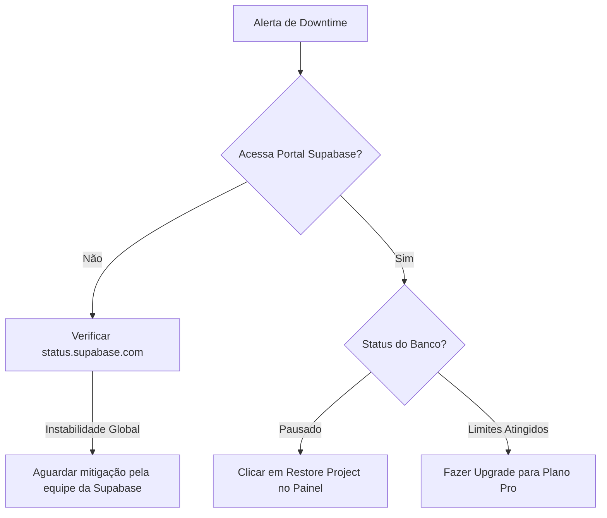

# Runbooks de Operações e Incidentes - Sistema CHAPADA

Este documento apresenta procedimentos padrão (SOP) para lidar com incidentes críticos no sistema **CHAPADA**.

---

## Runbook A: Queda de Serviço (Downtime total do Sistema)

### Sinais Identificadores
* Usuários relatam erro 502/504 Bad Gateway ao tentar abrir o sistema.
* Mensagens de erro de conexão ("Failed to fetch") na console do cliente React.
* Console do Supabase indica status "PAUSED" ou "INACTIVE".

### Passos de Resolução

1. **Verificar Status do Supabase:**
   Acesse a dashboard do Supabase e verifique o estado do projeto `vaibjtbayfpmvxxbtuxi`. Se o projeto estiver inativo devido a inatividade prolongada (plano gratuito), clique em **Restore Project** para reativar as máquinas.
2. **Verificar Provedor de Hospedagem (Vercel):**
   Acesse o painel do Vercel e verifique a saúde do deploy do front-end. Confirme se as variáveis de ambiente `VITE_SUPABASE_URL` e `VITE_SUPABASE_PUBLISHABLE_KEY` estão carregadas corretamente.
3. **Monitoramento de Limites:**
   Verifique as métricas de uso de CPU e conexões de banco de dados na dashboard do Supabase (Database -> Health). Se as conexões excederem o limite de 60 conexões simultâneas do plano gratuito, considere ativar o pool de conexões (Supavisor) ou fazer o upgrade do plano.

---

## Runbook B: Vazamento de Chaves de Acesso / Tokens API

### Sinais Identificadores
* Logs do sistema mostram requisições anômalas ou de IPs desconhecidos manipulando dados em massa.
* Detecção de commit contendo `VITE_SUPABASE_PUBLISHABLE_KEY` ou segredos no GitHub/GitLab público.

### Passos de Resolução
1. **Revogar a chave comprometida:**
   Acesse a dashboard do Supabase do projeto -> Settings -> API.
2. **Gerar nova chave Anon/Public:**
   Solicite a geração de um novo JWT secreto da API do projeto (isso invalidará instantaneamente todos os tokens anon antigos).
3. **Atualizar as variáveis de ambiente:**
   No Vercel e no arquivo local `.env`, atualize os valores de `VITE_SUPABASE_PUBLISHABLE_KEY` com a nova chave gerada.
4. **Redeploy do Front-end:**
   Execute um novo deploy no Vercel para carregar o novo token de segurança nas instâncias dos clientes finais.

---

## Runbook C: Erro Crítico pós-implantação (Rollback)

### Sinais Identificadores
* Crash completo da aplicação ou quebra de telas essenciais (como Projetos ou Atividades) após um commit na branch `main`.

### Passos de Resolução
1. **Rollback do Deploy no Vercel:**
   * Vá no painel do projeto Vercel.
   * Na aba **Deployments**, localize o último deploy estável e clique nos três pontos -> **Promote to Production**.
   * O Vercel apontará o tráfego de produção de volta para a versão anterior funcional em menos de 1 minuto.
2. **Reverter banco de dados (se houve migração problemática):**
   * Caso a migração tenha quebrado colunas, aplique o backup mais recente seguindo o manual de restore, ou execute o script de migração corretivo (Rollback Migration).
