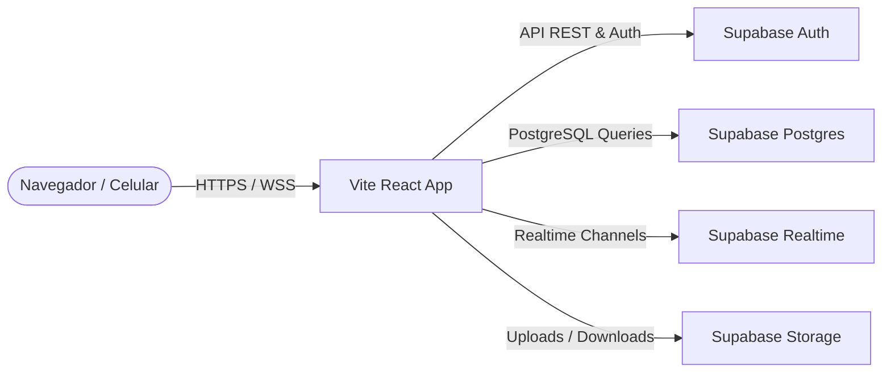

# Visão Geral e Arquitetura do Sistema

## 1. Descrição Geral da Aplicação
O **Sistema CHAPADA** é uma plataforma corporativa web sob medida para o **Centro de Habilitação e Apoio ao Pequeno Agricultor do Araripe (CHAPADA)**.
* **Propósito:** Automatizar o ciclo de gestão de projetos de convivência com o semiárido, saneamento rural, agroecologia e outras linhas de ação da ONG.
* **Funcionalidades Principais:**
  * Gestão de Contratos e Projetos (Status, Prazos, Municípios).
  * Catálogo de Tecnologias Sociais (Físicas como cisternas calçadão, metodológicas como DRP).
  * Controle de Atividades e Oficinas vinculadas aos projetos.
  * Cadastro unificado de beneficiários rurais (evitando contagem dupla).
  * Banco de imagens de prestação de contas com busca avançada.
  * Auditoria automatizada de alterações de dados.
* **Público-alvo:** Técnicos de campo, coordenadores de projetos, gestores administrativos da ONG e auditores de prestação de contas.

## 2. Arquitetura de Alto Nível
O sistema adota o paradigma **Serverless Single Page Application (SPA)** conectada a um **Backend-as-a-Service (BaaS)**:

### Componentes:
1. **Front-End SPA (React + Vite):** Interface web desenvolvida utilizando React 19, TypeScript, TailwindCSS 4, TanStack Router e TanStack Query para gerenciamento eficiente de dados.
2. **Supabase Auth:** Gerenciamento centralizado de identidades, sessões JWT e fluxos de cadastro e recuperação de senhas.
3. **Supabase Database (Postgres 17):** Banco relacional hospedado com suporte nativo a JSONB, arrays e Row Level Security.
4. **Supabase Storage:** Armazenamento distribuído para PDFs e imagens de prestação de contas.
5. **Realtime Engine (Presence):** Canal via WebSocket para monitorar o status online/ativo dos colaboradores em tempo real.
